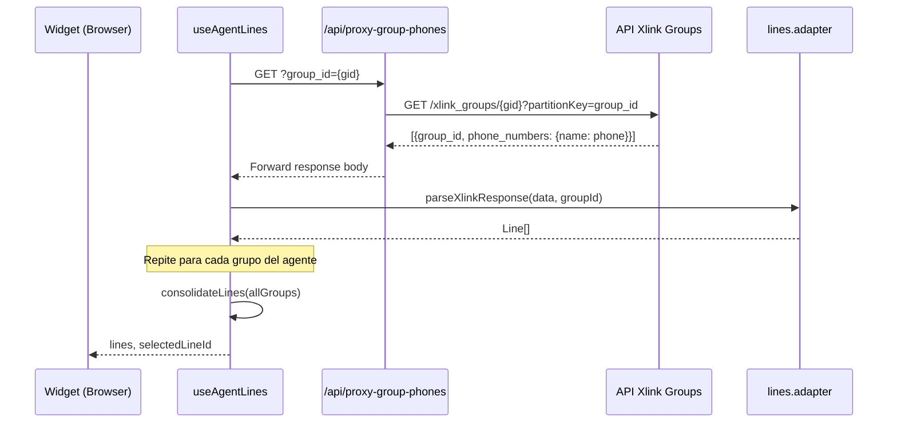

# Documento de Diseño — Filtrado de Líneas por Agente

## Visión General

Esta mejora reemplaza los datos mock de la ruta proxy `/api/proxy-group-phones` con llamadas reales a la API de Xlink Groups, y actualiza el adaptador de líneas (`lines.adapter.ts`) para parsear correctamente el formato de respuesta real donde `phone_numbers` es un objeto `{nombre: número_de_teléfono}` en lugar de un arreglo de objetos.

Los cambios se concentran en tres capas de la arquitectura existente:
1. **Framework Layer**: La ruta proxy `proxy-group-phones/route.ts` pasa de retornar datos mock a hacer una llamada HTTP real a la API externa de Xlink Groups, con URL base configurable por variable de entorno.
2. **Infrastructure Layer**: El adaptador `lines.adapter.ts` se actualiza para parsear el nuevo formato de respuesta (objeto `phone_numbers` con pares clave-valor) y transformarlo en entidades `Line` del dominio.
3. **Application Layer**: El hook `useAgentLines.ts` se mejora para manejar errores por grupo individual (degradación parcial), omitiendo grupos que fallen y continuando con los restantes.

No se modifican las entidades del dominio (`Line`), el caso de uso de consolidación (`consolidate-lines.ts`), ni los componentes de presentación. La arquitectura Clean Architecture existente se mantiene intacta.

## Arquitectura



### Decisiones de Diseño

1. **URL base configurable**: La URL de la API de Xlink Groups se lee de la variable de entorno `XLINK_GROUPS_API_URL`. Esto permite cambiar el endpoint sin modificar código y facilita el testing con diferentes ambientes (dev, staging, prod).

2. **Proxy transparente**: La ruta proxy reenvía la respuesta de Xlink sin modificaciones. El parsing se realiza en el adaptador del lado del cliente, manteniendo la separación de responsabilidades: el proxy solo se encarga del forwarding y manejo de errores HTTP.

3. **Función de parsing pura y extraída**: Se extrae una función pura `parseXlinkGroupResponse` del adaptador que transforma la respuesta de Xlink en `Line[]`. Esto permite testear el parsing de forma aislada sin mocks de `fetch`, y facilita property-based testing.

4. **Degradación parcial por grupo**: Si la llamada a la API falla para un grupo específico, `useAgentLines` omite ese grupo y continúa con los demás. Solo se muestra error si todos los grupos fallan.

5. **Sin cambios en la entidad `Line`**: El formato de la entidad `Line` ya tiene todos los campos necesarios (`id`, `number`, `phone_number_id`, `phone_number`, `groups`). El mapeo del nuevo formato de respuesta se resuelve en el adaptador.

## Componentes e Interfaces

### Cambios en la Ruta Proxy (`proxy-group-phones/route.ts`)

```typescript
// ANTES: retorna datos mock
// DESPUÉS: llama a la API real de Xlink Groups

export async function GET(request: Request): Promise<Response>
// 1. Extrae group_id de query params (ya existente)
// 2. Valida presencia de group_id → 400 si falta (ya existente)
// 3. Lee XLINK_GROUPS_API_URL de env vars
// 4. Hace GET a {XLINK_GROUPS_API_URL}/{group_id}?partitionKey=group_id
// 5. Si éxito → reenvía body sin modificar
// 6. Si error → retorna 502 con mensaje descriptivo
```

### Cambios en el Adaptador (`lines.adapter.ts`)

```typescript
// Nueva interfaz para tipar la respuesta de Xlink
interface XlinkGroupResponse {
  group_id: string;
  phone_numbers: Record<string, string>; // {nombre: número_de_teléfono}
}

// Nueva función pura de parsing (exportada para testing)
export function parseXlinkGroupResponse(
  data: unknown,
  groupId: string
): Line[]
// 1. Valida que data sea un arreglo → retorna [] si no
// 2. Para cada objeto del arreglo:
//    a. Extrae phone_numbers (objeto)
//    b. Si phone_numbers está vacío o ausente → omite
//    c. Para cada par [nombre, número] en phone_numbers:
//       - Crea Line con id=número, number=nombre,
//         phone_number_id=número, phone_number=número, groups=[groupId]
// 3. Retorna arreglo plano de todas las líneas

// fetchGroupPhones se actualiza para usar parseXlinkGroupResponse
export async function fetchGroupPhones(groupId: string): Promise<Line[]>
```

### Cambios en el Hook (`useAgentLines.ts`)

```typescript
// Cambio principal: manejo de errores por grupo individual
// ANTES: Promise.all (falla si cualquier grupo falla)
// DESPUÉS: Promise.allSettled (continúa con grupos exitosos)

// Si todos fallan → setError con mensaje descriptivo
// Si algunos fallan → usa los exitosos, omite los fallidos
```

## Modelos de Datos

### Respuesta de la API Xlink Groups

```typescript
// Formato real de la API externa
// GET https://.../xlink_groups/{group_id}?partitionKey=group_id
type XlinkGroupsApiResponse = XlinkGroupResponse[];

interface XlinkGroupResponse {
  group_id: string;
  phone_numbers: Record<string, string>;
  // Ejemplo: { "Line Name 1": "+573001234567", "Line Name 2": "+573009876543" }
}
```

### Mapeo de Xlink → Line

| Campo Xlink | Campo Line | Ejemplo |
|---|---|---|
| clave de `phone_numbers` | `number` | `"Line Name 1"` |
| valor de `phone_numbers` | `phone_number` | `"+573001234567"` |
| valor de `phone_numbers` | `id` | `"+573001234567"` |
| valor de `phone_numbers` | `phone_number_id` | `"+573001234567"` |
| `group_id` del objeto padre | `groups[0]` | `"some-group-id"` |

### Variable de Entorno Nueva

| Variable | Descripción | Ejemplo |
|---|---|---|
| `XLINK_GROUPS_API_URL` | URL base de la API de Xlink Groups | `https://zqi6swpat4.execute-api.us-east-1.amazonaws.com/dev/xlink_groups` |


## Propiedades de Corrección

*Una propiedad es una característica o comportamiento que debe mantenerse verdadero en todas las ejecuciones válidas de un sistema — esencialmente, una declaración formal sobre lo que el sistema debe hacer. Las propiedades sirven como puente entre especificaciones legibles por humanos y garantías de corrección verificables por máquina.*

### Propiedad 1: Round-trip de parsing Xlink → Line → phone_numbers

*Para cualquier* respuesta válida de Xlink Groups (arreglo de objetos con `group_id` y `phone_numbers` como objeto `{nombre: número}`), al parsear la respuesta a entidades `Line` y luego reconstruir el objeto `phone_numbers` agrupando las líneas por `groups[0]` y mapeando `number → phone_number`, el resultado debe ser equivalente al `phone_numbers` original de cada grupo.

**Valida: Requisitos 2.1, 2.2, 2.3, 3.1**

### Propiedad 2: Invariante estructural de entidades Line parseadas

*Para cualquier* respuesta válida de Xlink Groups con al menos un par clave-valor en `phone_numbers`, todas las entidades `Line` generadas por el adaptador deben tener los campos `id`, `number`, `phone_number_id` y `phone_number` como strings no vacíos, y el campo `groups` como un arreglo no vacío de strings.

**Valida: Requisito 3.2**

### Propiedad 3: Consolidación deduplica por phone_number y fusiona grupos completamente

*Para cualquier* conjunto de arreglos de `Line[]` con `phone_number` potencialmente duplicados entre grupos, la función `consolidateLines` debe producir un arreglo donde: (a) cada `phone_number` aparece exactamente una vez, (b) la cantidad de líneas resultantes es menor o igual a la cantidad total de líneas de entrada, y (c) el arreglo `groups` de cada línea consolidada contiene todos los `group_id` de las líneas originales con ese `phone_number`, sin duplicados.

**Valida: Requisitos 4.1, 4.2, 4.3**

## Manejo de Errores

| Escenario | Capa | Comportamiento | Código HTTP |
|---|---|---|---|
| Falta `group_id` en query params | Proxy Route | Retorna error con mensaje descriptivo | 400 |
| Variable `XLINK_GROUPS_API_URL` no configurada | Proxy Route | Retorna error de configuración | 500 |
| API Xlink retorna error HTTP | Proxy Route | Retorna error con código original en mensaje | 502 |
| Error de red al llamar API Xlink | Proxy Route | Retorna error de conectividad | 502 |
| Respuesta de Xlink no es arreglo válido | Adaptador | Retorna arreglo vacío, sin excepción | N/A |
| `phone_numbers` vacío o ausente en un grupo | Adaptador | Omite ese grupo, continúa con los demás | N/A |
| Falla fetch para un grupo específico | Hook | Omite ese grupo (Promise.allSettled), usa los exitosos | N/A |
| Fallan todos los grupos | Hook | Muestra error con botón de reintento | N/A |
| Error de red en el cliente | Hook | Muestra error descriptivo con botón de reintento | N/A |

### Principios

1. **Degradación parcial**: Si algunos grupos fallan pero otros no, se muestran las líneas disponibles.
2. **Sin excepciones no controladas**: El adaptador nunca lanza excepciones por datos malformados; retorna arreglo vacío.
3. **Mensajes descriptivos**: Los errores del proxy incluyen el código de estado original de la API externa.

## Estrategia de Testing

### Enfoque Dual

Tests unitarios basados en ejemplos para escenarios específicos y tests basados en propiedades para validar comportamiento universal del parsing y la consolidación.

### Tests Basados en Propiedades (PBT)

Se utiliza **fast-check** (ya instalado en el proyecto) como librería de PBT.

Cada test de propiedad debe:
- Ejecutar un mínimo de **100 iteraciones**
- Referenciar la propiedad del documento de diseño con un comentario
- Formato de tag: `Feature: agent-line-filtering, Property {N}: {texto}`

| Propiedad | Qué se genera | Qué se verifica |
|---|---|---|
| P1: Round-trip parsing | Respuestas Xlink aleatorias con grupos y phone_numbers variados | Parse → reconstruct = original |
| P2: Invariante estructural | Respuestas Xlink válidas con al menos un phone_number | Todos los campos de Line son strings no vacíos, groups es arreglo no vacío |
| P3: Consolidación completa | Arreglos de Line[] con phone_numbers duplicados entre grupos | Deduplicación correcta, count ≤ input, groups fusionados sin duplicados |

### Tests Unitarios (Basados en Ejemplos)

| Área | Tests |
|---|---|
| Proxy Route | Llamada correcta a API Xlink con group_id; error 400 sin group_id; error 502 cuando Xlink falla; URL construida desde env var |
| Adaptador - parsing | Parsing de respuesta con un grupo; parsing con múltiples grupos; phone_numbers vacío se omite; respuesta no-arreglo retorna []; campo mapping correcto (key→number, value→phone_number) |
| Adaptador - fetchGroupPhones | Integración fetch + parsing; error HTTP lanza excepción |
| Hook - useAgentLines | Degradación parcial (un grupo falla, otros no); todos los grupos fallan → error; fallback a channels sin grupos; auto-selección de primera línea |

### Tests de Integración

| Flujo | Qué se verifica |
|---|---|
| Carga completa de líneas | Auth → obtener grupos → fetch por grupo → parsing → consolidación → render en LineSelector |
| Degradación parcial | Un grupo falla → líneas de otros grupos se muestran correctamente |
| Reintento tras error total | Todos fallan → click reintento → nueva carga exitosa |

### Herramientas

- **Vitest** como test runner (ya configurado)
- **fast-check** para tests basados en propiedades (ya instalado)
- **React Testing Library** para tests de componentes (ya instalado)
