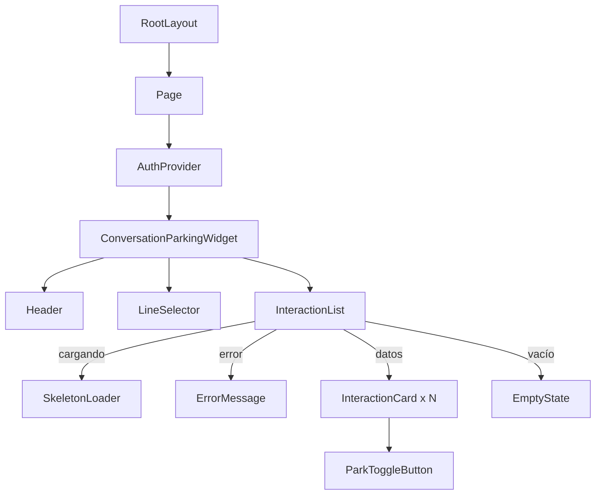

# Documento de Diseño — Conversation Parking Widget

## Visión General

Este documento describe el diseño técnico del widget de parqueo de conversaciones para Genesys Cloud. El widget permite a los agentes de un centro de contacto visualizar interacciones abiertas, parquear/desparquear conversaciones y enviar plantillas automáticamente al desparquear. Se construye como una aplicación Next.js 16 (App Router) con React 19, Tailwind CSS 4 y TypeScript, embebida dentro de Genesys Cloud.

La arquitectura sigue el patrón de **Clean Architecture** adaptado a Next.js, con separación clara en capas: Domain (entidades y puertos) → Application (casos de uso y hooks) → Infrastructure (implementaciones de servicios, API clients) → Presentation (componentes React). Las dependencias apuntan siempre hacia adentro: la capa de dominio no depende de ninguna otra capa.

### Estructura de Carpetas (Clean Architecture)

```
conversation_parking-widget/
├── app/                          # Framework Layer (Next.js App Router)
│   ├── api/                      # Route Handlers (API proxy)
│   │   ├── send-template/route.ts
│   │   ├── proxy-group-phones/route.ts
│   │   └── proxy-channels/route.ts
│   ├── page.tsx                  # Entry point (composición)
│   ├── layout.tsx
│   └── globals.css
├── src/
│   ├── domain/                   # Domain Layer (entidades + puertos)
│   │   ├── entities/
│   │   │   ├── interaction.ts    # Interfaz Interaction
│   │   │   ├── line.ts           # Interfaz Line
│   │   │   ├── auth.ts           # Interfaz AuthState
│   │   │   └── send-template.ts  # SendTemplateRequest/Response
│   │   └── ports/
│   │       ├── interaction-service.port.ts  # Interfaz InteractionService
│   │       └── template-service.port.ts     # Interfaz TemplateService
│   ├── application/              # Application Layer (casos de uso + hooks)
│   │   ├── use-cases/
│   │   │   ├── park-interaction.ts
│   │   │   ├── unpark-interaction.ts
│   │   │   ├── get-interactions.ts
│   │   │   └── consolidate-lines.ts
│   │   └── hooks/
│   │       ├── useAuth.ts
│   │       ├── useAgentLines.ts
│   │       ├── useInteractions.ts
│   │       └── useDurationTimer.ts
│   ├── infrastructure/           # Infrastructure Layer (implementaciones)
│   │   ├── services/
│   │   │   ├── mock-interaction.service.ts
│   │   │   ├── real-interaction.service.ts  # (futuro)
│   │   │   └── template.service.ts
│   │   ├── adapters/
│   │   │   ├── genesys-auth.adapter.ts      # extractToken, validateToken
│   │   │   └── lines.adapter.ts             # fetchGroupPhones, fetchChannels
│   │   └── config/
│   │       └── service-registry.ts          # Punto de intercambio mock/real
│   └── presentation/             # Presentation Layer (componentes React)
│       ├── components/
│       │   ├── AuthProvider.tsx
│       │   ├── ConversationParkingWidget.tsx
│       │   ├── Header.tsx
│       │   ├── LineSelector.tsx
│       │   ├── InteractionList.tsx
│       │   ├── InteractionCard.tsx
│       │   ├── ParkToggleButton.tsx
│       │   ├── SkeletonLoader.tsx
│       │   ├── ErrorMessage.tsx
│       │   └── EmptyState.tsx
│       └── providers/
│           └── AuthContext.tsx
├── __tests__/                    # Tests
│   ├── domain/
│   ├── application/
│   ├── infrastructure/
│   └── presentation/
```

## Arquitectura

```mermaid
graph TD
    subgraph "Genesys Cloud"
        GC_AUTH[OAuth Login Page]
        GC_API[/api/v2/users/me]
    end

    subgraph "Next.js App (App Router)"
        subgraph "Client Components"
            AUTH[AuthProvider]
            WIDGET[ConversationParkingWidget]
            LINE_SEL[LineSelector]
            CARD[InteractionCard]
            HEADER[Header - Xlink Brand]
            SKELETON[SkeletonLoader]
            ERROR[ErrorMessage]
        end

        subgraph "Hooks"
            USE_AUTH[useAuth]
            USE_LINES[useAgentLines]
            USE_INTERACTIONS[useInteractions]
            USE_TIMER[useDurationTimer]
        end

        subgraph "Services"
            ISERVICE[InteractionService Interface]
            MOCK[MockInteractionService]
            REAL[RealInteractionService - futuro]
        end

        subgraph "API Routes"
            PROXY[POST /api/send-template]
            PROXY_PHONES[GET /api/proxy-group-phones]
            PROXY_CHANNELS[GET /api/proxy-channels]
        end
    end

    subgraph "Servicios Externos"
        INFOBIP[Infobip API - send-template]
    end

    AUTH -->|valida token| GC_API
    AUTH -->|redirige si no hay token| GC_AUTH
    AUTH -->|obtiene grupos| GC_GROUPS[/api/v2/users/{id}?expand=groups]
    WIDGET -->|usa| USE_AUTH
    WIDGET -->|usa| USE_LINES
    WIDGET -->|usa| USE_INTERACTIONS
    USE_LINES -->|consulta phones por grupo| PROXY_PHONES
    USE_LINES -->|fallback| PROXY_CHANNELS
    LINE_SEL -->|selecciona línea| WIDGET
    CARD -->|usa| USE_TIMER
    CARD -->|desparquear → POST| PROXY
    PROXY -->|Basic Auth| INFOBIP
    USE_INTERACTIONS -->|consume| ISERVICE
    ISERVICE -.->|implementa| MOCK
    ISERVICE -.->|implementa| REAL
```

### Decisiones de Arquitectura

1. **Clean Architecture con 4 capas**: Domain (entidades puras + puertos/interfaces), Application (casos de uso + hooks), Infrastructure (implementaciones concretas de servicios, adapters), Presentation (componentes React). Las dependencias siempre apuntan hacia adentro: Presentation → Application → Domain ← Infrastructure.

2. **Domain Layer sin dependencias externas**: Las entidades (`Interaction`, `Line`, `AuthState`) y los puertos (`InteractionService`, `TemplateService`) son interfaces puras de TypeScript sin imports de React, Next.js ni librerías externas.

3. **Inversión de dependencias vía puertos**: Los hooks de la capa Application dependen de interfaces (puertos) definidas en Domain, no de implementaciones concretas. El `service-registry.ts` en Infrastructure inyecta la implementación correcta (mock o real).

4. **Client Components para todo el widget**: Dado que el widget requiere autenticación OAuth (acceso a `window.location`, `localStorage`) y estado interactivo en tiempo real (timers, toggles), todos los componentes del widget son Client Components (`"use client"`).

5. **Servicio mock intercambiable**: El mock y la futura implementación real implementan el mismo puerto `InteractionService`. El intercambio se realiza cambiando la configuración en `service-registry.ts`.

6. **API Route Handler para proxy**: Se usa un Route Handler de Next.js App Router (`app/api/send-template/route.ts`) en lugar del Pages Router, exponiendo solo POST. Las credenciales Basic Auth se mantienen en variables de entorno del servidor.

7. **Hooks como orquestadores de casos de uso**: Los hooks en Application consumen casos de uso y adapters, sirviendo como puente entre la lógica de negocio y los componentes de presentación.

8. **Obtención de líneas por grupos del agente**: Tras autenticarse, se obtienen los grupos del agente vía `/api/v2/users/{id}?expand=groups`. Para cada grupo se consultan los números de teléfono asociados vía `/api/proxy-group-phones`. Si el agente no tiene grupos, se usa `/api/proxy-channels` como fallback. Los números se consolidan eliminando duplicados.

## Componentes e Interfaces

### Árbol de Componentes



### Interfaces TypeScript Principales

```typescript
// src/domain/entities/interaction.ts
interface Interaction {
  id: string;
  originLine: string;
  destinationLine: string;
  startTimestamp: string; // ISO 8601
  isParked: boolean;
}

// src/domain/entities/line.ts
interface Line {
  id: string;
  number: string;          // Nombre o identificador de la línea
  phone_number_id: string; // ID del número de teléfono
  phone_number: string;    // Número de teléfono
  groups?: string[];       // IDs de grupos asociados (opcional)
}

// src/domain/ports/interaction-service.port.ts
interface InteractionService {
  getInteractions(selectedLineId?: string): Promise<Interaction[]>;
  parkInteraction(id: string): Promise<Interaction>;
  unparkInteraction(id: string): Promise<Interaction>;
}

// src/domain/ports/template-service.port.ts
interface TemplateService {
  sendTemplate(request: SendTemplateRequest): Promise<SendTemplateResponse>;
}
```

### Componentes

| Componente | Responsabilidad | Props |
|---|---|---|
| `AuthProvider` | Gestiona flujo OAuth, provee contexto de autenticación (incluye obtención de grupos del agente) | `children` |
| `ConversationParkingWidget` | Orquesta header + selector de línea + lista de interacciones | — |
| `Header` | Muestra logo Xlink + título "Conversation Parking" | — |
| `LineSelector` | Dropdown para seleccionar la línea activa del agente | `lines`, `selectedLineId`, `onSelect`, `isLoading` |
| `InteractionList` | Gestiona estados de carga/error/vacío/datos | `interactions`, `isLoading`, `error`, `onRetry`, `onTogglePark` |
| `InteractionCard` | Muestra datos de una interacción + botón de parqueo | `interaction`, `onTogglePark`, `isSending` |
| `SkeletonLoader` | Placeholder shimmer durante carga | `count` |
| `ErrorMessage` | Mensaje de error con botón de reintento | `message`, `onRetry` |
| `EmptyState` | Mensaje cuando no hay interacciones | — |
| `ParkToggleButton` | Botón para parquear/desparquear | `isParked`, `onClick`, `isLoading` |

### Hooks

| Hook | Capa | Responsabilidad | Retorno |
|---|---|---|---|
| `useAuth` | Application | Flujo OAuth completo (buscar token, validar, redirigir, obtener grupos del agente) | `{ isAuthenticated, isLoading, token, agent, agentGroupIds, error }` |
| `useAgentLines` | Application | Obtiene líneas del agente por grupos, consolida duplicados, maneja fallback | `{ lines, selectedLineId, setSelectedLineId, isLoading, error }` |
| `useInteractions` | Application | Orquesta casos de uso de interacciones vía puertos, filtradas por línea seleccionada | `{ interactions, isLoading, error, togglePark, retry }` |
| `useDurationTimer` | Application | Calcula duración en tiempo real desde timestamp | `string` (formato `HH:MM:SS`) |

### API Route Handler

```typescript
// app/api/send-template/route.ts
export async function POST(request: Request): Promise<Response>
// - Valida body (campos requeridos)
// - Construye Basic Auth desde env vars
// - Proxy a endpoint externo de Infobip
// - Retorna respuesta o error apropiado

// Rechaza otros métodos automáticamente (App Router solo exporta POST)
```

```typescript
// app/api/proxy-group-phones/route.ts
export async function GET(request: Request): Promise<Response>
// - Recibe group_id como query param
// - Consulta los números de teléfono asociados al grupo
// - Retorna lista de phone_numbers del grupo

// app/api/proxy-channels/route.ts
export async function GET(request: Request): Promise<Response>
// - Fallback: obtiene todos los canales disponibles
// - Retorna lista de canales con phone_number y name
```

## Modelos de Datos

### Interaction

```typescript
interface Interaction {
  id: string;              // ID único de la conversación en Genesys Cloud
  originLine: string;      // Número de teléfono de origen
  destinationLine: string; // Número de teléfono de destino
  startTimestamp: string;  // Fecha/hora de inicio en formato ISO 8601
  isParked: boolean;       // true = parqueada, false = activa
}
```

### AuthState

```typescript
interface AuthState {
  isAuthenticated: boolean;
  isLoading: boolean;
  token: string | null;
  agent: { name: string; id: string } | null;
  agentGroupIds: string[] | null; // null = pendiente, [] = sin grupos
  error: string | null;
}
```

### Line

```typescript
interface Line {
  id: string;              // Identificador único (phone_number)
  number: string;          // Nombre o identificador legible de la línea
  phone_number_id: string; // ID del número de teléfono
  phone_number: string;    // Número de teléfono completo
  groups?: string[];       // IDs de grupos asociados (opcional)
}
```

### SendTemplateRequest

```typescript
interface SendTemplateRequest {
  destinationLine: string;  // Número de destino para enviar la plantilla
  conversationId: string;   // ID de la conversación asociada
}
```

### SendTemplateResponse

```typescript
interface SendTemplateResponse {
  success: boolean;
  message?: string;
  error?: string;
}
```

### Datos Mock

El `MockInteractionService` retorna un arreglo estático de interacciones simuladas con IDs, números de teléfono y timestamps variados. Incluye interacciones en ambos estados (parqueadas y no parqueadas) para facilitar el desarrollo y pruebas visuales.


## Propiedades de Corrección

*Una propiedad es una característica o comportamiento que debe mantenerse verdadero en todas las ejecuciones válidas de un sistema — esencialmente, una declaración formal sobre lo que el sistema debe hacer. Las propiedades sirven como puente entre especificaciones legibles por humanos y garantías de corrección verificables por máquina.*

### Propiedad 1: Extracción de token desde múltiples fuentes

*Para cualquier* combinación de presencia/ausencia de token en el hash de la URL, parámetros de consulta y localStorage, el módulo de autenticación debe retornar el token si existe en al menos una fuente, y `null` si no existe en ninguna.

**Valida: Requisito 1.1**

### Propiedad 2: Deduplicación de líneas del agente

*Para cualquier* conjunto de respuestas de grupos con números de teléfono potencialmente duplicados, la función de consolidación debe retornar un arreglo de líneas sin duplicados, donde cada `phone_number` aparece exactamente una vez.

**Valida: Requisito 2.3**

### Propiedad 3: Completitud de datos de interacción

*Para cualquier* interacción retornada por el servicio (mock o real), la interacción debe contener todos los campos requeridos: `id` (string no vacío), `originLine` (string no vacío), `destinationLine` (string no vacío), `startTimestamp` (string ISO 8601 válido) e `isParked` (booleano).

**Valida: Requisito 2.2**

### Propiedad 4: Renderizado completo de datos en tarjeta de interacción

*Para cualquier* interacción válida, al renderizar su `InteractionCard`, el resultado debe contener la línea de origen, la línea de destino, la duración formateada y un indicador del estado de parqueo.

**Valida: Requisito 4.1**

### Propiedad 5: Cálculo correcto de duración

*Para cualquier* par de timestamps (inicio, ahora) donde `ahora >= inicio`, la función de cálculo de duración debe retornar un string en formato `HH:MM:SS` cuyo valor numérico en segundos sea igual a la diferencia `ahora - inicio` truncada a segundos.

**Valida: Requisito 4.2**

### Propiedad 6: Round-trip del estado de parqueo

*Para cualquier* interacción, al ejecutar la acción de toggle de parqueo, el campo `isParked` debe cambiar a su valor opuesto. Al ejecutar toggle dos veces consecutivas, el estado debe retornar al valor original.

**Valida: Requisitos 5.1, 6.1**

### Propiedad 7: Construcción correcta de credenciales Basic Auth

*Para cualquier* par de strings (usuario, contraseña), el header de autorización construido por la API proxy debe ser exactamente `"Basic " + base64(usuario + ":" + contraseña)`.

**Valida: Requisito 7.3**

### Propiedad 8: Validación rechaza bodies incompletos

*Para cualquier* subconjunto propio de los campos requeridos (`destinationLine`, `conversationId`), al enviar una solicitud POST a `/api/send-template` con ese subconjunto, la respuesta debe tener código de estado 400 y un mensaje indicando los campos faltantes.

**Valida: Requisito 7.5**

### Propiedad 9: Presencia de aria-labels en elementos interactivos

*Para cualquier* interacción válida, al renderizar su `InteractionCard`, todos los elementos interactivos (botones de parquear/desparquear) deben tener un atributo `aria-label` no vacío y descriptivo.

**Valida: Requisito 9.3**

## Manejo de Errores

### Errores de Autenticación

| Escenario | Comportamiento | Recuperación |
|---|---|---|
| Token no encontrado en ninguna fuente | Redirigir a login OAuth de Genesys Cloud | Automática (flujo OAuth) |
| Validación de token falla (401/403) | Eliminar token de localStorage, redirigir a login | Automática (flujo OAuth) |
| Error de red al validar token | Mostrar mensaje de error con botón de reintento | Manual (botón reintento) |

### Errores del Servicio de Interacciones

| Escenario | Comportamiento | Recuperación |
|---|---|---|
| Fallo al obtener interacciones | Mostrar `ErrorMessage` con descripción y botón de reintento | Manual (botón reintento) |
| Respuesta con formato inesperado | Tratar como error, mostrar mensaje genérico | Manual (botón reintento) |

### Errores de Obtención de Líneas del Agente

| Escenario | Comportamiento | Recuperación |
|---|---|---|
| Fallo al obtener grupos del agente | Intentar fallback con `/api/proxy-channels` | Automática (fallback) |
| Fallo al obtener phones de un grupo | Omitir ese grupo, continuar con los demás | Automática (degradación parcial) |
| Fallo en fallback `/api/proxy-channels` | Mostrar error con botón de reintento | Manual (botón reintento) |
| Agente sin líneas asignadas | Mostrar mensaje indicando que no hay líneas disponibles | N/A |

### Errores de la API Proxy de Plantillas

| Escenario | Comportamiento | Recuperación |
|---|---|---|
| Body sin campos requeridos | Retornar HTTP 400 con lista de campos faltantes | Cliente corrige solicitud |
| Fallo del endpoint externo (5xx) | Retornar HTTP 502 con mensaje descriptivo | Manual (reintento desde tarjeta) |
| Timeout del endpoint externo | Retornar HTTP 504 con mensaje de timeout | Manual (reintento desde tarjeta) |
| Método HTTP no permitido | Retornar HTTP 405 (automático en App Router) | N/A |

### Errores en Tarjeta de Interacción

| Escenario | Comportamiento | Recuperación |
|---|---|---|
| Fallo al enviar plantilla al desparquear | Mostrar error inline en la tarjeta, mantener estado parqueado | Manual (botón reintento en tarjeta) |
| Error de red durante toggle de parqueo | Revertir estado visual, mostrar error | Manual (reintentar acción) |

### Principios de Manejo de Errores

1. **Nunca dejar al usuario sin salida**: Todo error muestra una acción de recuperación (reintento o redirección).
2. **Mensajes descriptivos**: Los errores incluyen contexto sobre qué falló, no solo códigos genéricos.
3. **Preservar estado**: Si una operación falla, el estado de la UI se revierte al estado anterior.
4. **Degradación elegante**: Si el servicio de interacciones falla, el widget muestra el error pero no se rompe.

## Estrategia de Testing

### Enfoque Dual

La estrategia combina tests unitarios basados en ejemplos con tests basados en propiedades para cobertura completa.

### Tests Basados en Propiedades (PBT)

Se utilizará **fast-check** como librería de PBT para TypeScript/JavaScript.

Cada test de propiedad debe:
- Ejecutar un mínimo de **100 iteraciones**
- Referenciar la propiedad del documento de diseño con un comentario
- Formato de tag: `Feature: conversation-parking-widget, Property {N}: {texto}`

| Propiedad | Qué se genera | Qué se verifica |
|---|---|---|
| P1: Extracción de token | Combinaciones de token en hash/query/localStorage | Token encontrado si existe en alguna fuente |
| P2: Deduplicación de líneas | Listas de grupos con phone_numbers duplicados | Sin duplicados en resultado consolidado |
| P3: Completitud de datos | Interacciones aleatorias del mock | Todos los campos requeridos presentes y válidos |
| P4: Renderizado de tarjeta | Interacciones aleatorias válidas | Presencia de todos los datos en el DOM renderizado |
| P5: Cálculo de duración | Pares de timestamps aleatorios | Formato HH:MM:SS correcto y valor numérico correcto |
| P6: Round-trip de parqueo | Interacciones aleatorias con isParked aleatorio | Toggle cambia estado, doble toggle restaura |
| P7: Basic Auth | Pares usuario/contraseña aleatorios | Header Authorization correcto en base64 |
| P8: Validación de body | Subconjuntos aleatorios de campos requeridos | HTTP 400 cuando faltan campos |
| P9: Aria-labels | Interacciones aleatorias válidas | Todos los botones tienen aria-label no vacío |

### Tests Unitarios (Basados en Ejemplos)

| Área | Tests |
|---|---|
| Autenticación | Token almacenado en localStorage tras encontrarlo; redirección a login sin token; eliminación de token inválido; obtención de grupos del agente |
| Líneas del agente | Carga de líneas por grupos; deduplicación de números; auto-selección de primera línea; fallback a proxy-channels sin grupos |
| Servicio de interacciones | Obtención exitosa de interacciones; filtrado por línea seleccionada; manejo de error con mensaje y reintento |
| UI - Header | Logo Xlink presente con alt correcto; título "Conversation Parking" visible |
| UI - LineSelector | Renderizado de opciones de línea; cambio de línea seleccionada; estado de carga |
| UI - InteractionCard | Diferenciación visual parqueada/no parqueada; indicador de carga durante envío |
| UI - Estados | Skeleton loader durante carga; mensaje de estado vacío; mensaje de error con reintento; "Cargando líneas..." |
| API Proxy | Error 502 al fallar endpoint externo; error 400 con campos faltantes |

### Tests de Integración

| Flujo | Qué se verifica |
|---|---|
| Desparqueo completo | Toggle → llamada a API proxy → actualización visual |
| Flujo de autenticación | Carga → búsqueda de token → validación → acceso al widget |
| Reintento tras error | Error de servicio → click reintento → nueva llamada al servicio |

### Herramientas

- **Vitest** como test runner
- **React Testing Library** para tests de componentes
- **fast-check** para tests basados en propiedades
- **MSW (Mock Service Worker)** para mocking de API en tests de integración
