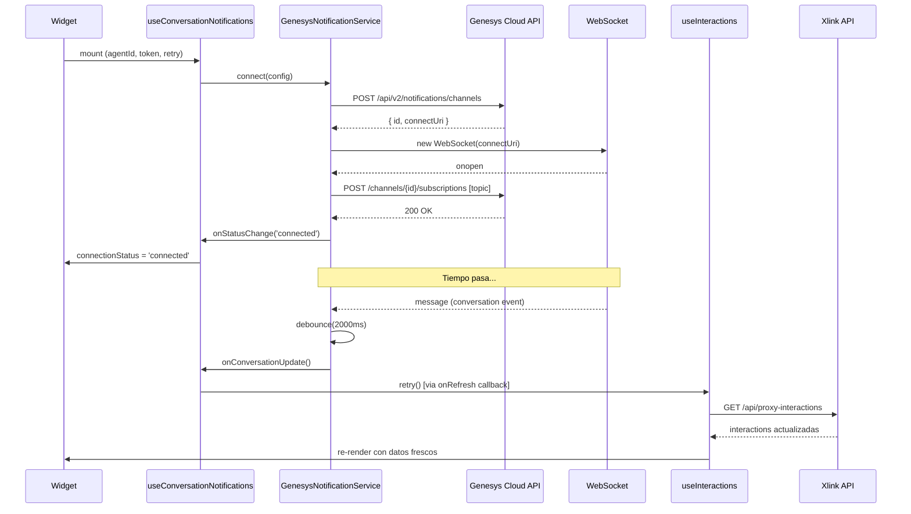
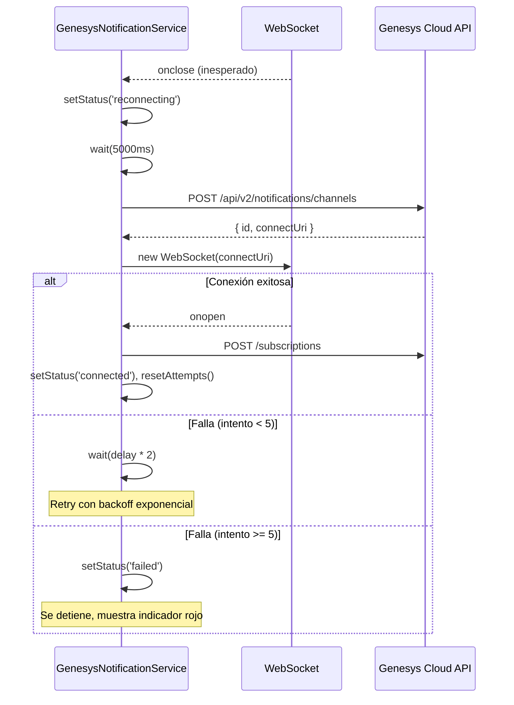

# Documento de Diseño: Sincronización en Tiempo Real de Interacciones

## Visión General

Este diseño implementa sincronización automática del widget de Conversation Parking usando la Notifications API de Genesys Cloud. Cuando las conversaciones del agente cambian de estado (nuevo mensaje, transferencia, desconexión), el widget recibe un evento vía WebSocket y re-obtiene las interacciones desde Xlink API, manteniendo la lista de interacciones parqueadas siempre actualizada.

La solución sigue la arquitectura hexagonal existente: define un puerto en dominio, implementa el servicio de notificaciones en infraestructura, y orquesta la conexión desde un hook de aplicación que se integra con el widget.

## Arquitectura

```mermaid
graph TD
    subgraph Genesys Cloud
        NA[Notifications API]
        WS[WebSocket Server]
    end

    subgraph Infraestructura
        GNS[GenesysNotificationService] -->|POST /channels| NA
        GNS -->|WebSocket connect| WS
        GNS -->|POST /subscriptions| NA
    end

    subgraph Aplicación
        UCN[useConversationNotifications hook]
        UI[useInteractions]
    end

    subgraph Presentación
        CPW[ConversationParkingWidget]
        CSI[ConnectionStatusIndicator]
    end

    WS -->|eventos| GNS
    GNS -->|onConversationUpdate callback| UCN
    UCN -->|llama retry()| UI
    CPW --> UCN
    CPW --> CSI
```

### Decisiones de Diseño

1. **Proxy server-side para crear canal**: Las llamadas a la Notifications API de Genesys (`POST /channels`, `POST /subscriptions`) se hacen directamente desde el cliente con el Bearer token del agente (igual que la validación de auth). No necesitan proxy porque no involucran secretos de Xlink.

2. **WebSocket nativo del navegador**: Se usa `WebSocket` nativo en lugar de librerías como socket.io. La conexión es simple (un solo canal, un solo topic) y no justifica una dependencia adicional.

3. **Debounce de 2 segundos**: Cuando llegan múltiples eventos rápidos (ej: varios participantes cambian en una conversación), se agrupan en un solo refresh para evitar llamadas excesivas a Xlink API.

4. **Reconexión con backoff exponencial**: Si la conexión se pierde, se reintenta con tiempos crecientes (5s, 10s, 20s, 40s, 60s max). Después de 5 intentos fallidos consecutivos, se detiene y muestra estado "desconectado".

5. **El evento solo dispara refresh, no actualiza estado directamente**: El payload del evento de Genesys no contiene el estado de "parqueado" (eso es de Xlink). Por lo tanto, el evento solo sirve como señal para re-fetch desde Xlink API.

6. **Hook independiente (`useConversationNotifications`)**: No se mezcla con `useInteractions`. El hook de notificaciones solo necesita el `agentId`, `token`, y una función `onRefresh` callback. Esto mantiene separación de responsabilidades.

## Componentes e Interfaces

### Puerto de Dominio: `NotificationService`

```typescript
// src/domain/ports/notification-service.port.ts

export type ConnectionStatus = 'disconnected' | 'connecting' | 'connected' | 'reconnecting' | 'failed';

export interface NotificationServiceConfig {
  token: string;
  agentId: string;
  environment: string;
  onConversationUpdate: () => void;
  onStatusChange: (status: ConnectionStatus) => void;
}

export interface NotificationService {
  connect(config: NotificationServiceConfig): Promise<void>;
  disconnect(): void;
  getStatus(): ConnectionStatus;
}
```

### Servicio de Infraestructura: `GenesysNotificationService`

```typescript
// src/infrastructure/services/genesys-notification.service.ts

export class GenesysNotificationService implements NotificationService {
  private ws: WebSocket | null = null;
  private channelId: string | null = null;
  private status: ConnectionStatus = 'disconnected';
  private reconnectAttempts: number = 0;
  private reconnectTimer: ReturnType<typeof setTimeout> | null = null;
  private debounceTimer: ReturnType<typeof setTimeout> | null = null;
  private config: NotificationServiceConfig | null = null;

  private static readonly MAX_RECONNECT_ATTEMPTS = 5;
  private static readonly BASE_RECONNECT_DELAY_MS = 5000;
  private static readonly MAX_RECONNECT_DELAY_MS = 60000;
  private static readonly DEBOUNCE_DELAY_MS = 2000;

  async connect(config: NotificationServiceConfig): Promise<void>;
  disconnect(): void;
  getStatus(): ConnectionStatus;

  private async createChannel(): Promise<{ id: string; connectUri: string }>;
  private async subscribe(channelId: string): Promise<void>;
  private openWebSocket(connectUri: string): void;
  private handleMessage(event: MessageEvent): void;
  private handleClose(event: CloseEvent): void;
  private handleError(event: Event): void;
  private scheduleReconnect(): void;
  private getReconnectDelay(): number;
  private debouncedRefresh(): void;
  private setStatus(status: ConnectionStatus): void;
  private cleanup(): void;
}
```

**Responsabilidades:**
- Crear canal de notificación via API REST de Genesys
- Suscribirse al topic `v2.users.{agentId}.conversations.messages`
- Mantener conexión WebSocket abierta
- Filtrar heartbeats (`channel.metadata`)
- Debounce de eventos (2s)
- Reconexión automática con backoff exponencial
- Limpieza de recursos al desconectar

### Hook de Aplicación: `useConversationNotifications`

```typescript
// src/application/hooks/useConversationNotifications.ts

export interface UseConversationNotificationsResult {
  connectionStatus: ConnectionStatus;
}

export function useConversationNotifications(
  agentId: string | null,
  token: string | null,
  onRefresh: () => void
): UseConversationNotificationsResult;
```

**Responsabilidades:**
- Instanciar `GenesysNotificationService` al montar
- Conectar cuando `agentId` y `token` están disponibles
- Pasar `onRefresh` (que será `retry` de `useInteractions`) como callback
- Desconectar al desmontar o cuando cambian las dependencias
- Exponer `connectionStatus` para el indicador visual

### Componente de Presentación: `ConnectionStatusIndicator`

```typescript
// src/presentation/components/ConnectionStatusIndicator.tsx

interface ConnectionStatusIndicatorProps {
  status: ConnectionStatus;
}
```

- Renderiza un punto de color según el estado:
  - `connected`: punto verde (`bg-green-500`) + tooltip "Sincronización activa"
  - `connecting` / `reconnecting`: punto amarillo parpadeante (`bg-amber-500 animate-pulse`) + tooltip "Reconectando..."
  - `disconnected` / `failed`: punto rojo (`bg-red-500`) + tooltip "Sin conexión en tiempo real"
- Tamaño: `w-2.5 h-2.5 rounded-full`
- Posición: junto al botón FAB de refresh o en el header

## Modelo de Datos

### Estado interno del servicio

```typescript
interface NotificationServiceState {
  ws: WebSocket | null;
  channelId: string | null;
  status: ConnectionStatus;
  reconnectAttempts: number;
  reconnectTimer: ReturnType<typeof setTimeout> | null;
  debounceTimer: ReturnType<typeof setTimeout> | null;
  config: NotificationServiceConfig | null;
}
```

### Flujo de Datos



### Flujo de Reconexión



## Integración con el Widget

### Cambios en `ConversationParkingWidget`

```typescript
function ConversationParkingWidgetInner() {
  const { agent, token } = useAuthContext();
  const { interactions, isLoading, error, unpark, sendingIds, retry } =
    useInteractions(agent?.id ?? null, token, addToast);

  // NUEVO: Sincronización en tiempo real
  const { connectionStatus } = useConversationNotifications(
    agent?.id ?? null,
    token,
    retry  // retry = fetchInteractions = refresh de la lista
  );

  return (
    <div className="relative flex flex-col h-full bg-white">
      {/* ... contenido existente ... */}

      {/* Floating refresh button CON indicador de conexión */}
      <div className="fixed bottom-4 right-4 z-40 flex items-center gap-2">
        <ConnectionStatusIndicator status={connectionStatus} />
        <button onClick={retry} /* ... */ />
      </div>
    </div>
  );
}
```

## Llamadas a la API de Genesys

### Crear canal

```
POST https://api.{environment}/api/v2/notifications/channels
Authorization: Bearer {token}
Content-Type: application/json
```

Response: `{ "id": "channel-id", "connectUri": "wss://..." }`

### Suscribirse a topic

```
POST https://api.{environment}/api/v2/notifications/channels/{channelId}/subscriptions
Authorization: Bearer {token}
Content-Type: application/json

Body: [{ "id": "v2.users.{agentId}.conversations.messages" }]
```

### Formato de evento recibido por WebSocket

```json
{
  "topicName": "v2.users.{agentId}.conversations.messages",
  "eventBody": {
    "id": "conversation-id",
    "participants": [...]
  }
}
```

Heartbeat (ignorar):
```json
{
  "topicName": "channel.metadata",
  "eventBody": { "message": "WebSocket Heartbeat" }
}
```

## Manejo de Errores

| Escenario | Comportamiento |
|-----------|---------------|
| Fallo al crear canal (401) | Token expirado — no reintentar, dejar que auth maneje |
| Fallo al crear canal (5xx) | Reintentar con backoff |
| WebSocket cierra con código 1000 (normal) | No reconectar (cierre intencional) |
| WebSocket cierra con otro código | Reconectar con backoff |
| Error de red al suscribirse | Reintentar la suscripción |
| Token expira durante conexión activa | WebSocket se cerrará, reconexión fallará con 401, setStatus('failed') |
| Navegador pierde conectividad | WebSocket se cierra, reconexión cuando vuelva la red |

## Estrategia de Testing

### Tests Unitarios

| Componente | Qué se testea |
|------------|---------------|
| `GenesysNotificationService` | Crear canal, suscribirse, manejar mensajes, debounce, reconexión |
| `useConversationNotifications` | Conectar al montar, desconectar al desmontar, pasar callback |
| `ConnectionStatusIndicator` | Renderizado correcto de colores y tooltips según estado |

### Mocking

- `fetch` se mockea para las llamadas REST (crear canal, suscribir)
- `WebSocket` se mockea con una clase fake que emite eventos
- Timers se controlan con `vi.useFakeTimers()`

### Tests de Integración

- Verificar que un evento WebSocket dispara `retry()` en `useInteractions`
- Verificar que el debounce agrupa múltiples eventos en un solo refresh
- Verificar que la desconexión limpia todos los recursos

## Consideraciones de Seguridad

- El token OAuth se usa directamente en las llamadas a Genesys (client-side, igual que la autenticación existente)
- No se exponen secretos adicionales — la Notifications API solo requiere el Bearer token del agente
- El WebSocket URI (`connectUri`) es temporal y específico del canal creado

## Consideraciones de Performance

- Un solo WebSocket por instancia del widget (no uno por interacción)
- Debounce de 2s evita ráfagas de re-fetch
- El refresh reutiliza la misma función `fetchInteractions` existente
- No hay polling — solo se hace fetch cuando llega un evento real

