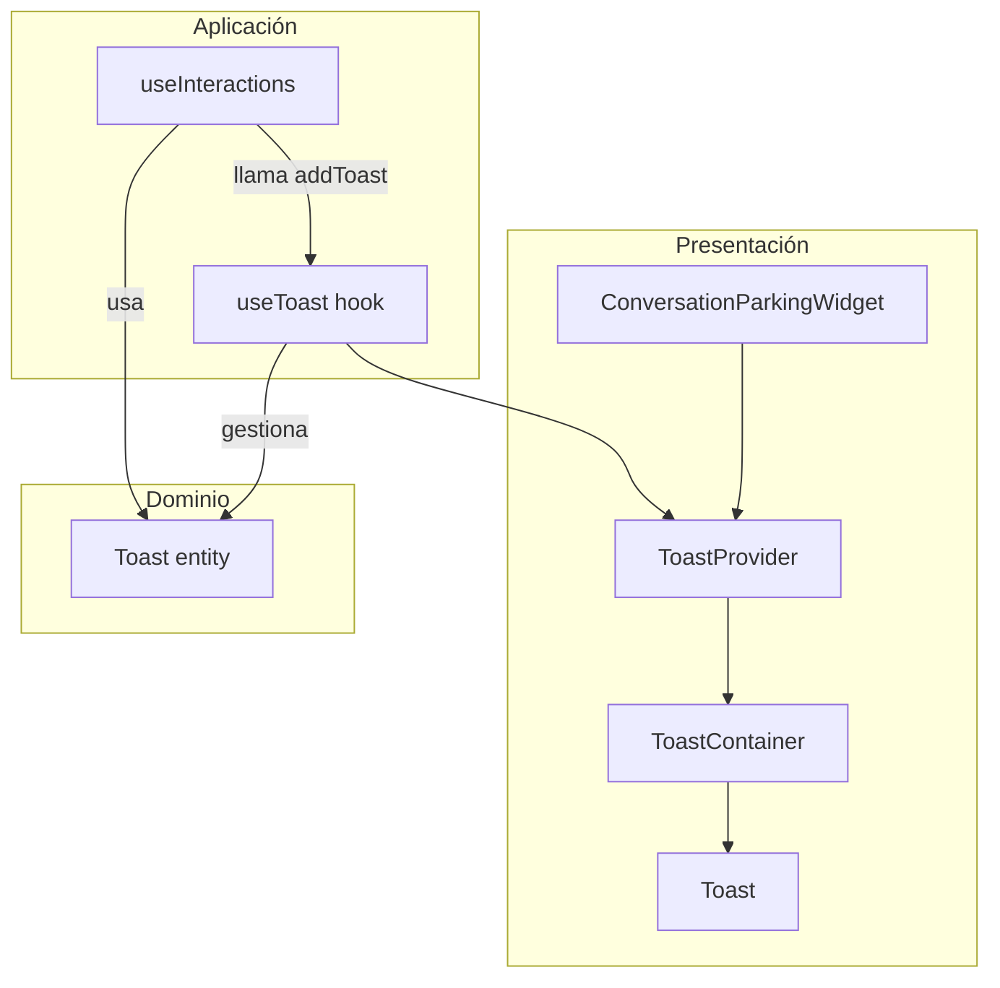
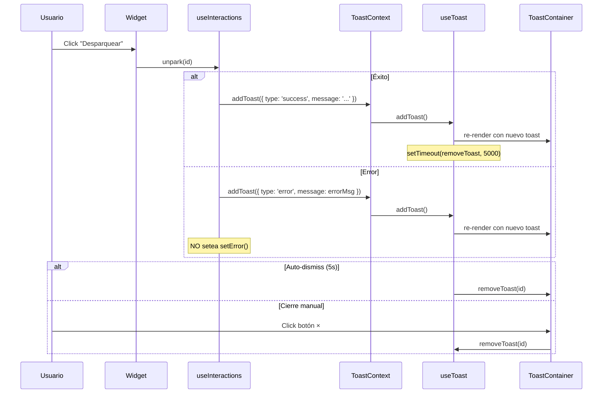

# Documento de Diseño: Notificaciones de Resultado al Desparquear

## Visión General

Este diseño implementa un sistema de notificaciones toast ligero y desacoplado para el widget de Conversation Parking. El sistema notifica al usuario el resultado de la operación de unpark (éxito o error) sin bloquear la interfaz ni contaminar el estado de error general de la lista de interacciones.

La solución sigue la arquitectura hexagonal existente: define una entidad de dominio (`Toast`), un hook de aplicación (`useToast`) para gestionar el ciclo de vida, y componentes de presentación (`Toast`, `ToastContainer`) para el renderizado.

## Arquitectura



### Decisiones de Diseño

1. **Context Provider (`ToastProvider`) en lugar de hook aislado**: Se usa un Context para que `useInteractions` pueda disparar toasts sin prop-drilling. Sigue el patrón existente de `AuthContext`/`AuthProvider`.

2. **Estado en el hook `useToast`, no en `useInteractions`**: El estado de toasts vive en su propio hook/contexto. `useInteractions` solo consume la función `addToast` del contexto, manteniendo separación de responsabilidades.

3. **Desacoplamiento del error general**: La función `unpark` en `useInteractions` deja de setear `setError()` en caso de fallo de unpark. En su lugar, llama a `addToast({ type: 'error', message })`. El estado `error` queda reservado para errores de carga de la lista.

4. **Sin librería externa**: Se implementa un sistema toast mínimo (~100 líneas) con Tailwind CSS, evitando dependencias adicionales.

5. **Pointer-events pass-through**: El `ToastContainer` usa `pointer-events: none` en el overlay y `pointer-events: auto` solo en cada toast individual, permitiendo interacción con el widget subyacente.

## Componentes e Interfaces

### Entidad de Dominio: `Toast`

```typescript
// src/domain/entities/toast.ts

export type ToastType = 'success' | 'error';

export interface Toast {
  id: string;
  type: ToastType;
  message: string;
  createdAt: number; // timestamp ms
}
```

### Hook de Aplicación: `useToast`

```typescript
// src/application/hooks/useToast.ts

export interface UseToastResult {
  toasts: Toast[];
  addToast: (params: { type: ToastType; message: string }) => void;
  removeToast: (id: string) => void;
}
```

**Responsabilidades:**
- Mantener el array de toasts activos
- Generar IDs únicos (crypto.randomUUID o fallback con Date.now + Math.random)
- Programar auto-eliminación a los 5000ms tras creación
- Limpiar timers al desmontar (cleanup en useEffect)

### Context Provider: `ToastProvider`

```typescript
// src/presentation/providers/ToastContext.tsx

export interface ToastContextValue {
  addToast: (params: { type: ToastType; message: string }) => void;
  removeToast: (id: string) => void;
}

export const ToastContext = createContext<ToastContextValue>(/* ... */);
export function useToastContext(): ToastContextValue;
```

```typescript
// src/presentation/components/ToastProvider.tsx

export function ToastProvider({ children }: { children: ReactNode }): JSX.Element;
```

**Patrón**: Idéntico a `AuthContext` + `AuthProvider`. El provider ejecuta `useToast()` internamente y expone `addToast`/`removeToast` vía contexto. Renderiza `ToastContainer` con los toasts actuales.

### Componentes de Presentación

#### `ToastContainer`

```typescript
// src/presentation/components/ToastContainer.tsx

interface ToastContainerProps {
  toasts: Toast[];
  onDismiss: (id: string) => void;
}
```

- Posición: `fixed` en la esquina superior derecha del widget
- Layout: `flex flex-col gap-2` para apilar toasts verticalmente
- Overlay: `pointer-events-none` en el contenedor, `pointer-events-auto` en cada toast
- z-index alto (50) para estar sobre el contenido del widget

#### `ToastItem`

```typescript
// src/presentation/components/ToastItem.tsx

interface ToastItemProps {
  toast: Toast;
  onDismiss: (id: string) => void;
}
```

- Renderiza un toast individual con:
  - Icono según tipo (check para éxito, X para error)
  - Mensaje de texto
  - Botón de cierre (×)
  - Estilos condicionales: `bg-green-50 border-green-500` (éxito) o `bg-red-50 border-red-500` (error)
- Animación de entrada: `animate-slide-in` (keyframe CSS personalizado)
- Accesibilidad: `role="alert"`, `aria-live="assertive"`

## Modelo de Datos

### Estado del Toast Manager

```typescript
interface ToastState {
  toasts: Toast[];          // Array ordenado por createdAt (más reciente al final)
  timers: Map<string, NodeJS.Timeout>;  // Timers de auto-dismiss por toast ID
}
```

### Flujo de Datos



### Integración con `useInteractions`

Cambio clave en la función `unpark`:

```typescript
// Antes (actual):
catch (err) {
  setError(err instanceof Error ? err.message : "Error al desparquear...");
}

// Después (propuesto):
catch (err) {
  const message = err instanceof Error 
    ? err.message 
    : "No se pudo desparquear la conversación. Intenta de nuevo.";
  addToast({ type: 'error', message });
  // NO se llama setError() — el error queda solo en el toast
}
```

Y en el caso de éxito:

```typescript
// Después del refetch exitoso:
addToast({ type: 'success', message: 'Conversación desparqueada exitosamente' });
```

Para acceder a `addToast` desde `useInteractions`, el hook recibirá la función como parámetro opcional:

```typescript
export function useInteractions(
  agentId: string | null,
  token: string | null,
  addToast?: (params: { type: ToastType; message: string }) => void
): UseInteractionsResult;
```

## Propiedades de Correctitud

*Una propiedad es una característica o comportamiento que debe mantenerse verdadero en todas las ejecuciones válidas de un sistema — esencialmente, una declaración formal sobre lo que el sistema debe hacer. Las propiedades sirven como puente entre especificaciones legibles por humanos y garantías de correctitud verificables por máquina.*

### Propiedad 1: Correctitud en la creación de toasts según resultado de unpark

*Para cualquier* resultado de operación de unpark (éxito o fallo con mensaje arbitrario), el Toast_Manager SHALL crear un toast con el tipo correcto (`success` o `error`) y el mensaje correspondiente (mensaje fijo de éxito, mensaje de error del servicio, o mensaje por defecto si no hay mensaje específico).

**Validates: Requirements 1.1, 2.1, 2.3**

### Propiedad 2: Completitud del ciclo de vida del toast

*Para cualquier* toast creado (de cualquier tipo y con cualquier mensaje), el toast SHALL tener un timer de auto-eliminación programado a exactamente 5000ms Y un botón de cierre manual visible.

**Validates: Requirements 3.1, 3.3**

### Propiedad 3: Apilamiento sin solapamiento

*Para cualquier* conjunto de N toasts visibles simultáneamente (donde N ≥ 2), cada toast SHALL ocupar una posición vertical única y no solaparse con ningún otro toast visible.

**Validates: Requirements 4.3**

### Propiedad 4: Desacoplamiento del estado de error general

*Para cualquier* fallo en la operación de unpark, el estado de error general (`error` en `useInteractions`) SHALL permanecer sin modificar (mantener su valor previo, típicamente `null`), y el error SHALL comunicarse exclusivamente mediante un toast.

**Validates: Requirements 5.1**

## Manejo de Errores

| Escenario | Comportamiento |
|-----------|---------------|
| Unpark falla con mensaje del servicio | Toast de error con el mensaje específico |
| Unpark falla sin mensaje (error genérico) | Toast de error con mensaje por defecto |
| Error de red / timeout | Toast de error con mensaje del catch |
| Múltiples fallos simultáneos | Cada fallo genera su propio toast, se apilan |
| Toast no se puede crear (edge case extremo) | Fail silently, no romper el widget |

### Mensajes por defecto

- **Éxito**: `"Conversación desparqueada exitosamente"`
- **Error genérico**: `"No se pudo desparquear la conversación. Intenta de nuevo."`

## Estrategia de Testing

### Tests Unitarios (example-based)

| Componente | Qué se testea |
|------------|---------------|
| `useToast` hook | Crear toast, remover toast, auto-dismiss con fake timers |
| `ToastItem` | Renderizado correcto de estilos según tipo (verde/rojo) |
| `ToastItem` | Botón de cierre dispara `onDismiss` |
| `ToastContainer` | Renderiza múltiples toasts, posicionamiento |
| `useInteractions` (modificado) | No setea `error` en fallo de unpark, llama `addToast` |

### Tests de Propiedades (property-based con fast-check)

Cada propiedad del diseño se implementa como un test de propiedad con mínimo 100 iteraciones:

| Propiedad | Estrategia de generación |
|-----------|--------------------------|
| P1: Correctitud de creación | Generar resultados aleatorios (éxito/error con mensajes arbitrarios), verificar tipo y mensaje del toast |
| P2: Ciclo de vida completo | Generar toasts con tipos y mensajes aleatorios, verificar timer + botón cierre |
| P3: Apilamiento | Generar N toasts (2-10) aleatorios, verificar posiciones únicas |
| P4: Desacoplamiento | Generar errores aleatorios de unpark, verificar que `error` state no cambia |

### Configuración

- **Framework**: Vitest 4 con `@testing-library/react`
- **PBT Library**: `fast-check`
- **Iteraciones mínimas**: 100 por propiedad
- **Tag format**: `Feature: unpark-notifications, Property N: [título]`

### Estructura de archivos de test

```
src/application/hooks/useToast.test.ts          # Unit + property tests del hook
src/presentation/components/ToastItem.test.tsx   # Unit tests del componente
src/presentation/components/ToastContainer.test.tsx  # Unit + property tests
src/application/hooks/useInteractions.test.ts    # Tests actualizados (desacoplamiento)
```
